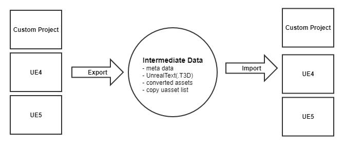
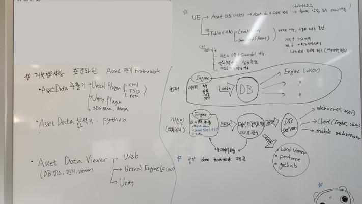

# Unreal Engine Migrate Tool

- A framework to import data from a custom Unreal Engine into vanilla UE4 and UE5




## Descriptions
- We do not expect the existing project's data to work perfectly in the vanilla engine, but our goal is to prevent crashes during import and to process the data into a usable form.
- This is intended to enable R&D based on existing data in the vanilla Unreal Engine.
- It can also be used to compare functionalities with the vanilla engine if issues arise in the existing project.
- Conversely, it can be utilized for migration from the vanilla engine to the custom engine.




#### Exporter
- Used to export data from projects using a custom engine to a vanilla engine.
- Each project may contain custom data, which needs to be either removed or replaced with equivalent functionalities during export to make it compatible with the vanilla engine.
- Files that do not require conversion are simply added to the copy file list.
- If exporting as a vanilla uasset is not possible, export the metadata.


#### Intermediate Data
- Intermediate data includes metadata, copy asset lists, etc.
- The export decision is based on comparing the dates of the .uasset and metadata to be exported.


#### Importer
- Determines whether to copy directly or go through the import process based on intermediate data.
- Decides whether to import by comparing the dates of the imported .uasset and the intermediate data.


 
### Example) UE4 migrate to UE5

* Install to UE4 ( source )
```
# install migration tool
UE4_Project/Content> git clone https://github.com/ubuntunux/UE_Migrate_Tool

# install migration scripts
cd UE_Migrate_Tool
UE4_Project/Content/UE_Migrate_Tool> git clone https://github.com/ubuntunux/UE_Migrate_Tool
```

* Export from UE4 ( source )

  - In Unreal Engine, navigate to the Content/UE_Migrate_Tool/UE4_Exporter folder in the Content Browser.
  - Inside this folder, run the Editor Utility Widget asset.

```
UE4_Project/Content/UE_Migrate_Tool/UE4_Exporter/UE4_Exporter.uasset
```


* Install to UE5 ( target )
```
UE5_Project/Content> git clone https://github.com/ubuntunux/UE_Migrate_Tool

# install migration scripts
cd UE_Migrate_Tool
UE5_Project/Content/UE_Migrate_Tool> git clone https://github.com/ubuntunux/UE_Migrate_Tool
```

* Import to UE5 ( source )

  - In Unreal Engine, navigate to the Content/UE_Migrate_Tool/UE4_Exporter folder in the Content Browser.
  - Inside this folder, run the Editor Utility Widget asset.

```
UE5_Project/Content/UE_Migrate_Tool/UE5_Importer/UE4_Exporter.uasset
```

## Module: Unreal Text Parser
- A module that parses UnrealText (.T3D) files and returns them as objects, making it easier to handle text files.
- https://github.com/ubuntunux/UE_Migrate_Tool/blob/main/parsing_unreal_text.py

**Example)**

```
>>> from parsing_unreal_text import parser_unreal_text
>>> unreal_text = """
    Begin Object Class=/Script/UnrealEd.SceneThumbnailInfo Name="CustomStaticMeshPart_146"
      Begin Object Name="SourceComponent"
         StaticMesh=StaticMesh'"/Game/Environment/BG_BaseBox_SM.BG_BaseBox_SM"'
         StaticMeshImportVersion=1
         RelativeLocation=(X=-1605.832275,Y=-1191.363281,Z=478.546143)
         RelativeRotation=(Pitch=0.000000,Yaw=-0.000020,Roll=0.000000)
         RelativeScale3D=(X=0.362768,Y=0.257098,Z=0.414737)
         bVisible=False
         bHiddenInGame=True
      End Object
      DisabledMaterialSets(0)=0
      DisabledMaterialSets(1)=2
      ObjectName="Cam_BlokingBox_04"
      Guid=6FFB0BA3420EF56546E55186C885A07E
   End Object
   """
 
>>> uobject = parser_unreal_text(unreal_text)
>>> print(uobject)
Begin Object id=1849101420432 index=0 depth=0 children=1
    Attributes(2):
        Class=/Script/UnrealEd.SceneThumbnailInfo
        Name=CustomStaticMeshPart_146
    Values(3):
        DisabledMaterialSets(2):
            [0]=0
            [1]=2
        ObjectName=Cam_BlokingBox_04
        Guid=6FFB0BA3420EF56546E55186C885A07E
    Extras(0):
    Begin Object id=1849101433488 index=0 depth=1 children=0
        Attributes(1):
            Name=SourceComponent
        Values(7):
            StaticMesh=StaticMesh'"/Game/Environment/BG_BaseBox_SM.BG_BaseBox_SM"'
            StaticMeshImportVersion=1
            RelativeLocation=(X=-1605.832275,Y=-1191.363281,Z=478.546143)
            RelativeRotation=(Pitch=0.000000,Yaw=-0.000020,Roll=0.000000)
            RelativeScale3D=(X=0.362768,Y=0.257098,Z=0.414737)
            bVisible=False
            bHiddenInGame=True
        Extras(0):
    End Object
End Object
 
>>> uobject.get_attribute('Class')
/Script/UnrealEd.SceneThumbnailInfo
 
>>> uobject.get_attribute('Name')
CustomStaticMeshPart_146
 
>>> uobject.get_value('ObjectName')
Cam_BlokingBox_04
 
>>> uobject.get_value('Guid')
6FFB0BA3420EF56546E55186C885A07E
 
>>> uobject.get_value('DisabledMaterialSets')
[0, 2]
 
>>> source_components = uobject.get_children_has_value('StaticMesh', recursive=True)
>>> source_components[0].get_attribute('Name')
SourceComponent
 
>>> source_components[0].get_value('StaticMesh')
StaticMesh'"/Game/Environment/BG_BaseBox_SM.BG_BaseBox_SM"'
 
>>> source_components[0].get_value('RelativeLocation')
(X=-1605.832275,Y=-1191.363281,Z=478.546143)
 
>>> child = uobject.get_uobject_by_id(1849101433488)
>>> print(child)
Begin Object id=1849101433488 index=0 depth=1 children=0
    Attributes(1):
        Name=SourceComponent
    Values(7):
        StaticMesh=StaticMesh'"/Game/Environment/BG_BaseBox_SM.BG_BaseBox_SM"'
        StaticMeshImportVersion=1
        RelativeLocation=(X=-1605.832275,Y=-1191.363281,Z=478.546143)
        RelativeRotation=(Pitch=0.000000,Yaw=-0.000020,Roll=0.000000)
        RelativeScale3D=(X=0.362768,Y=0.257098,Z=0.414737)
        bVisible=False
        bHiddenInGame=True
    Extras(0):
End Object
```
